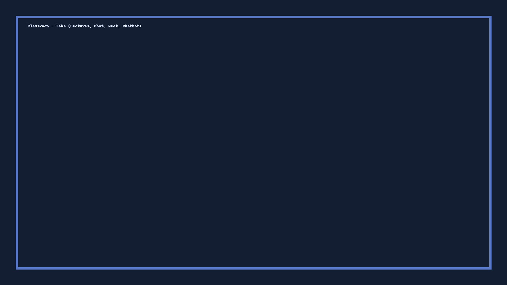

# Program Classroom (Vanilla, WebRTC, Role-based)

**All-in-one** classroom platform using **Express + Socket.IO + SQLite** and **Vanilla HTML/CSS/JS**.
- Teacher/Student registration and login
- Teachers create classrooms; Students join via **code or invite link**
- Classroom page with tabs: **Lectures, Chat, Meet, Chatbot**
- Real **WebRTC Meet** (camera/mic + screen share) with:
  - Student: Join, Mute, Unmute, Leave
  - Teacher: Create (implicit), Invite, Kick (by name), Mute/Unmute self, Leave, End Meet
- Discord-like theme with light/dark toggle

## Quick Start
```bash
cd server
npm install
npm start
# open http://localhost:5000
```

### Environment
- `.env` already included:
```
PORT=5000
JWT_SECRET=changeme123
```

## Flows
### Register & Login
- Teachers: name, email, university, college, password → login → **Teacher Dashboard**
- Students: name, email, university, college, **student ID**, password → login → **Student Dashboard**

### Teacher Dashboard
- **Create Classroom** → gets a code (e.g., `X2F9QK`)
- List of classrooms (hover actions):
  - **Open** → classroom.html?id=ID
  - **Invite** → copies link `http://localhost:5000/join.html?classroom=ID&code=CODE`

### Student Dashboard
- **Join Classroom** by code
- See list of joined classrooms → open

### Classroom
Tabs:
- **Lectures**: stub (you can wire `/api/uploads/:classroomId`)
- **Chat**: class chat via Socket.IO
- **Meet**: WebRTC video grid — role-based controls
- **Chatbot**: placeholder

## Notes
- DB file auto-creates at `server/classroom.db`
- No demo users included — register fresh accounts
- Everything is served from Express on **http://localhost:5000**

## Screenshots
(Placeholders included in `/screenshots` and referenced here)





<!-- Uploads section injected by assistant -->
<div class="uploads-section">
  <h3>Uploads</h3>
  <div id="uploads-list">Loading uploads...</div>
  <!-- Teacher-only controls (show if teacher) -->
  <div id="upload-controls">
    <input type="file" id="upload-input" />
    <button id="upload-btn">Upload</button>
  </div>
</div>
<script>
/* Basic uploads client-side JS added by assistant.
   Expects backend endpoints:
   GET /api/uploads?classId=... -> returns JSON array of {id, name, url, uploadedBy, type}
   POST /api/uploads -> form-data file + classId, returns created object
   DELETE /api/uploads/{id} -> deletes (teacher only)
*/
async function fetchUploads(classId){
  try{
    const res=await fetch(`/api/uploads?classId=${classId}`);
    const data=await res.json();
    const container=document.getElementById('uploads-list');
    if(!data || data.length===0){ container.innerHTML='<p>No uploads yet.</p>'; return; }
    container.innerHTML = data.map(u=>`<div class="upload-item" data-id="${u.id}">
      <a href="${u.url}" target="_blank">${u.name}</a>
      <span> — ${u.uploadedBy}</span>
      <button onclick="deleteUpload('${u.id}')" style="margin-left:8px">Delete</button>
    </div>`).join('');
  }catch(e){
    console.error(e);
  }
}
async function uploadFile(classId){
  const f = document.getElementById('upload-input').files[0];
  if(!f) return alert('Select a file first');
  const fd = new FormData();
  fd.append('file', f);
  fd.append('classId', classId);
  const res = await fetch('/api/uploads', {method:'POST', body:fd});
  if(res.ok){ fetchUploads(classId); document.getElementById('upload-input').value=''; }
  else { alert('Upload failed'); }
}
async function deleteUpload(id){
  if(!confirm('Delete this upload?')) return;
  const res = await fetch('/api/uploads/'+id, {method:'DELETE'});
  if(res.ok) fetchUploads(window.__CURRENT_CLASS_ID || '');
  else alert('Delete failed');
}
document.getElementById && document.getElementById('upload-btn') && document.getElementById('upload-btn').addEventListener('click', ()=>uploadFile(window.__CURRENT_CLASS_ID || ''));
</script>
